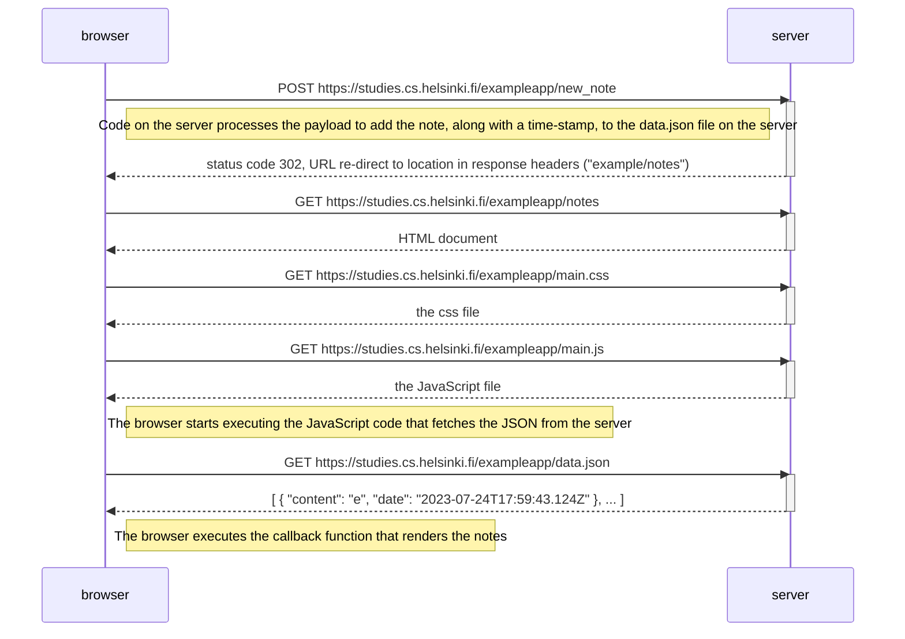

# Full Stack Open

## Part 0

### 0.4: New Note Diagram

> **TASK:**
>
> Create a diagram depicting the situation where the user creates a new note on the page https://studies.cs.helsinki.fi/exampleapp/notes by writing something into the text field and clicking the submit button.

### Notes

The sequence is almost identical to [loading the page](https://fullstackopen.com/en/part0/fundamentals_of_web_apps#loading-a-page-containing-java-script-review).

The POST request triggers server side actions that ultimately result in the page re-loading. At this point the interactions between browser and server follow the same sequence as the above linked depiction.

---