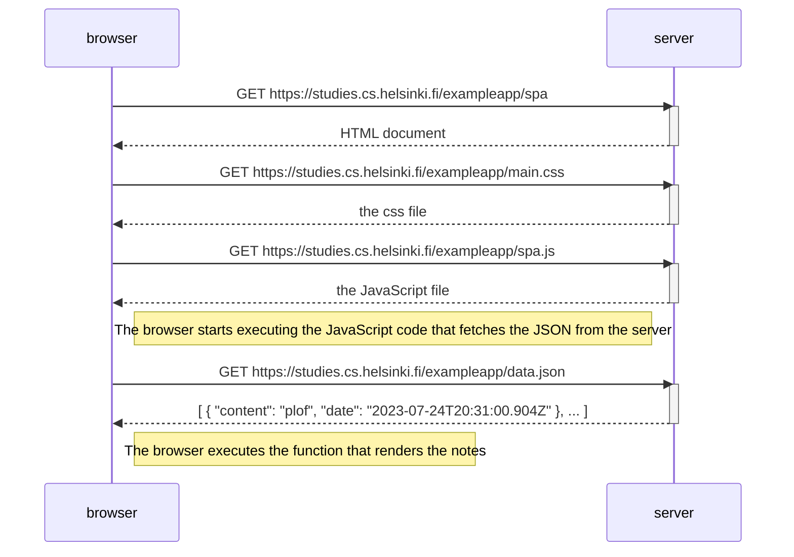

# Full Stack Open 2023

## Part 0: Fundamentals of Web Apps

### 0.5: Single Page App Diagram

#### TASK:

> Create a diagram depicting the situation where the user goes to the single-page app version of the notes app at https://studies.cs.helsinki.fi/exampleapp/spa.

#### SOLUTION:

#### NOTES

Again the sequence is very familiar - almost identical to [loading the page](https://fullstackopen.com/en/part0/fundamentals_of_web_apps#loading-a-page-containing-java-script-review).

In terms of server actions the differences are the target of both the initial GET action and the one that returns the JavaScript file.

[| &lt;&lt;&lt; BACK |](../part_0/README.md)