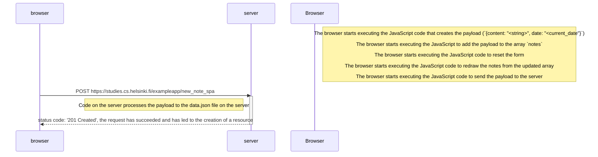

# Full Stack Open

## Part 0

### 0.6: New Note In Single Page App Diagram

> **TASK:**
>
> Create a diagram depicting the situation where the user creates a new note using the single-page app version of the notes app at https://studies.cs.helsinki.fi/exampleapp/spa.

### Notes

This is where an SPA design starts to shine. The majority of the work is processed by the browser before contacting the sever resulting in only a single POST and response.

This can minimise web-traffic, server strain and load times while maximising efficiency  

---